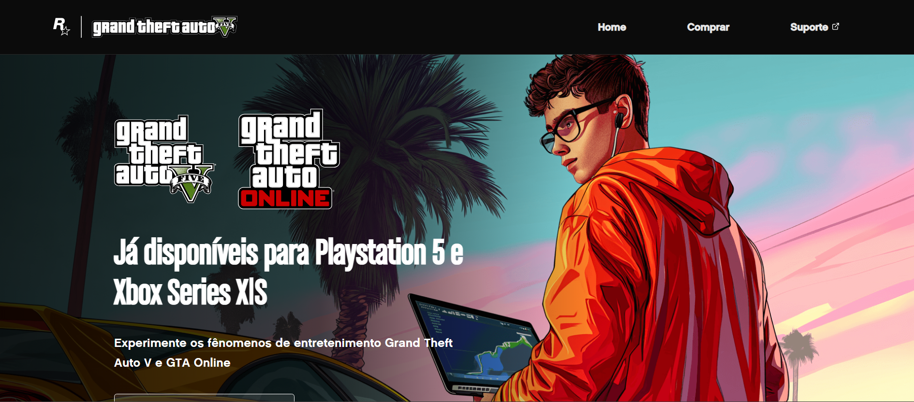

# 🚀 Projeto GTA - Landing Page



> Landing page inspirada no universo do jogo GTA, desenvolvida com foco em design responsivo e interações com JavaScript.

### 🔗 [Acesse a Demo Ao Vivo](https://alanborgesdev.github.io/gta-landing-page/)

---

### ✨ Funcionalidades Principais

- **Carrossel Interativo:** Botões para alternar entre imagens com transições suaves em CSS.
- **Botão "Comprar":** Link funcional para a página de compra do jogo na loja correspondente (PS, Xbox, PC).
- **Design Responsivo:** Layout adaptado para uma experiência de usuário ideal em dispositivos móveis e desktops.
- **Efeitos Visuais:** Efeitos de `hover` e um vídeo de fundo que aumentam a imersão.

---

### 🛠️ Tecnologias Utilizadas

- **HTML5** para a estrutura semântica do conteúdo.
- **CSS3** para estilização, animações e responsividade.
- **JavaScript** para a manipulação do DOM e interatividade do carrossel.

---

### 🔧 Como Rodar o Projeto

```bash
# 1. Clone o repositório
git clone https://github.com/alanborgesdev/gta-landing-page.git

# 2. Navegue até o diretório
cd gta-landing-page

# 3. Abra o arquivo index.html no seu navegador
# Não é necessário instalar dependências.
```

---

### 👤 Autor  

Este projeto foi desenvolvido por **[Alan Borges](https://github.com/alanborgesdev)** como parte do curso **DevQuest**,com o objetivo de solidificar os conceitos fundamentais de HTML, CSS e JavaScript na prática. 

---

### 📝 Licença

O código-fonte deste projeto está licenciado sob a [Licença MIT](LICENSE).